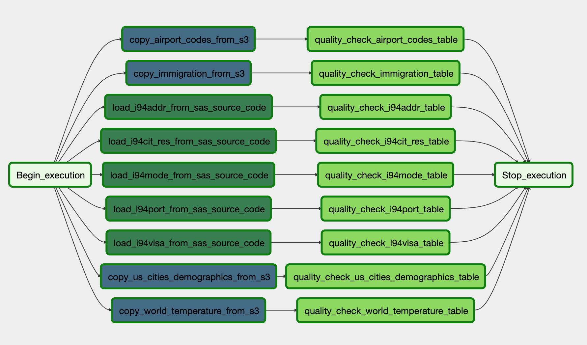

# Data Engineering Capstone Project
This project is end to end which we create an ETL pipeline for I94 immigration, global land temperatures and US demographics datasets to form an analytics database on immigration events. A use case for this analytics database is to find immigration patterns to the US. For example, we could try to find answears our questions

# Dataset
The following datasets were used to create the analytics database:
* I94 Immigration Data: This data comes from the US National Tourism and Trade Office found [here](https://travel.trade.gov/research/reports/i94/historical/2016.html). Each report contains international visitor arrival statistics by world regions and select countries (including top 20), type of visa, mode of transportation, age groups, states visited (first intended address only), and the top ports of entry (for select countries).
* World Temperature Data: This dataset came from Kaggle found [here](https://www.kaggle.com/berkeleyearth/climate-change-earth-surface-temperature-data).
* U.S. City Demographic Data: This dataset contains information about the demographics of all US cities and census-designated places with a population greater or equal to 65,000. Dataset comes from OpenSoft found [here](https://public.opendatasoft.com/explore/dataset/us-cities-demographics/export/).
* Airport Code Table: This is a simple table of airport codes and corresponding cities. The airport codes may refer to either IATA airport code, a three-letter code which is used in passenger reservation, ticketing and baggage-handling systems, or the ICAO airport code which is a four letter code used by ATC systems and for airports that do not have an IATA airport code (from wikipedia). It comes from [here](https://datahub.io/core/airport-codes#data).

# Data Model
Conceptual Data Model

# 1 - Immigrations - Fact Table

* `1-cicid 2-year 3-month 4-cit 5-res `
* `6-iata 7-arrdate 8-mode 9-addr 10-depdate `
* `11-bir 12-visa 13-coun 14-dtadfil 15-visapost `
* `16-occup 17-entdepa 18-entdepd 19-entdepu`
* `20-matflag 21-biryear 22-dtaddto 23-gender 24-insnum 25-airline`
* `26-admnum 27-fltno 28-visatype`

# 2 - Airports - Dimension Table

* 1 - `iata_code`
* 2 - `name` 
* 3 - `type` 
* 4 - `local_code` 
* 5 - `coordinates` 
* 6 - `city` 

# 3 - Demographics - Dimension Table

* 1  - `city`
* 2  - `state` 
* 3  - `media_age` 
* 4  - `male_population` `
* 5  - `female_population` 
* 6  - `total_population` 
* 7  - `num_veterans` 
* 8  - `foreign_born` 
* 9  - `average_household_size` 
* 10 - `state_code` 
* 11 - `race` 
* 12 - `count` 

# 4 - Temperature - Dimension Table

* 1  - `timestamp`
* 2  - `average_temperature` 
* 3  - `average_temperatur_uncertainty` 
* 4  - `male_population` `
* 5  - `city` 
* 6  - `country` 
* 7  - `latitude` 
* 8  - `longitude` 

# Data Pipeline


## Setup
1. Python3 & Java 8 Required
2. Create virtual environment and install dependencies
    ```bash
    $ python3 -m venv venv
    $ source venv/bin/activate
    (venv) $ pip install -r requirements.txt
    (venv) $ ipython kernel install --user --name=projectname
    ```
3. set java version to java8 if not default
    ```bash
    (venv) $ export JAVA_HOME=`/usr/libexec/java_home -v 1.8`
    ```
4. create aws config
   * create file `dwh.cfg`
   * add the following contents (fill the fields)
    ```bash
    [CLUSTER]
    HOST=
    DB_NAME=
    DB_USER=
    DB_PASSWORD=
    DB_PORT=
    ARN=
    [S3]
    BUCKET=
   ```
5. Initialize Airflow & Run Webserver
    ```bash
    (venv) $ export AIRFLOW_HOME=$(pwd)
    (venv) $ airflow initdb
    (venv) $ airflow webserver -p 8080
    ```
6. Run Scheduler (Open New Terminal Tab)
    ```bash
    (venv) $ export AIRFLOW_HOME=$(pwd)
    (venv) $ airflow scheduler
    ```

## Usage
1. Create Tables:
    ```bash
    (venv) $ python create_tables.py
    ```
2. Access Airflow UI at `localhost:8080`
3. Create Airflow Connections
4. Run `etl_dag` in Airflow UI
